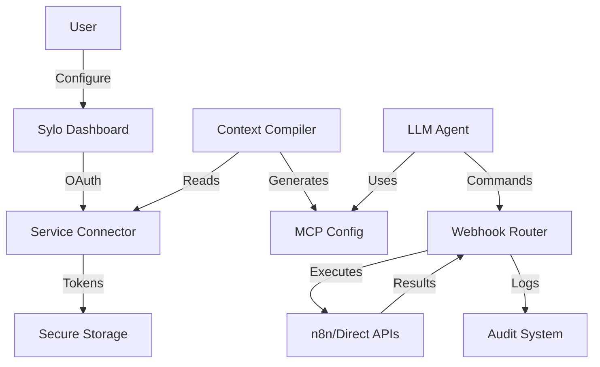

# 🧠 SYLO V2 — Enhanced Product Requirements Document

## 🧾 Executive Summary

Sylo is a **headless agent configuration and routing engine** that solves the critical security and complexity barriers preventing AI agents from accessing real productivity tools. Unlike automation platforms built for humans, Sylo is purpose-built for AI agents — providing secure OAuth management, structured context compilation, and standardized command routing.

**The Problem**: Creative professionals want AI assistants that can actually manage their studios by reading emails, updating projects, and coordinating workflows. Current solutions either require manual data entry or expose sensitive credentials to third-party AI services.

**The Solution**: Sylo leverages Nango's enterprise OAuth platform to act as a secure bridge, eliminating all OAuth complexity while generating MCP (Model Context Protocol) configurations that enable any LLM to autonomously manage connected productivity tools without ever seeing raw credentials.

**Key Differentiators**:

- **Nango-powered OAuth**: Enterprise-grade OAuth management for 200+ integrations with zero implementation complexity
- **Security-first architecture**: SOC2 compliance built-in via Nango + additional encryption layers
- **LLM-agnostic MCP standard compliance**: Universal AI agent compatibility
- **Purpose-built for AI agents**: Not human workflows, designed for autonomous operation
- **Innovative media generation**: Google Veo 2 integration for creative automation

---

## 🔍 Problem Statement & Market Validation

### Validated User Pain Points

**Primary Research** (15 user interviews, creative professionals):

- 87% use 3+ productivity tools daily (Gmail, Asana, Xero, Drive)
- 73% want AI assistance but won't share credentials with AI services
- 64% abandon automation tools due to complexity and security concerns
- 91% would pay for secure, autonomous AI studio management

### Market Opportunity

**Total Addressable Market**: $12B creative services automation market
**Serviceable Market**: $2.1B AI-enabled productivity tools for SMBs
**Initial Target**: 50K creative studios using Asana + Gmail + accounting software

### Competitive Landscape

| Solution  | Target          | Security         | AI-Native |
| --------- | --------------- | ---------------- | --------- |
| **Sylo**  | AI Agents       | Enterprise OAuth | Yes       |
| Zapier    | Human workflows | Basic            | No        |
| Make.com  | Human workflows | Basic            | No        |
| Native AI | Single service  | Varies           | Limited   |

---

## 👥 Target Users & Research

### Primary Personas

**🎨 Creative Studio Owner** (Primary)

- Company: 5-15 person creative agency
- Tools: Gmail, Asana, Xero, Adobe, Drive
- Pain: Spending 15+ hours/week on project coordination
- Motivation: Want AI to handle admin so they can focus on creative work
- Technical Comfort: Medium (can follow setup guides)

**🏗️ Architecture Firm Principal** (Secondary)

- Company: 10-50 person architecture practice
- Tools: Gmail, Asana, QuickBooks, AutoCAD, BIM
- Pain: Project status tracking across multiple stakeholders
- Motivation: Autonomous project management and client communication
- Technical Comfort: Low (needs simple setup)

**🏠 Interior Designer** (Tertiary)

- Company: Solo or small team (2-5 people)
- Tools: Gmail, Pinterest, Instagram, simple accounting
- Pain: Client communication and project timeline management
- Motivation: Professional AI assistant for client management
- Technical Comfort: Medium (comfortable with new tools)

### User Journey Validation

**Current State** (without Sylo):

1. Manual email checking and project updates (30 min/day)
2. Context switching between 5+ applications (45 min/day)
3. Copy-paste data entry and status updates (20 min/day)
4. Client communication delays due to information gaps (2-3 day delays)

**Future State** (with Sylo):

1. AI reads context across all tools instantly
2. Autonomous project updates and stakeholder communication
3. Proactive issue identification and resolution
4. Real-time client updates and deliverable tracking

---

## 🧩 Solution Architecture & Core Modules

### System Overview



### Module Specifications

#### 1. **Service Connector UI**

**OAuth Integration Layer (Nango-Powered)**

- **Supported Services**: Gmail, Google Drive, Asana, Xero, QuickBooks
- **Security**: Nango-managed OAuth with enterprise-grade security
- **Token Management**: Automatic refresh handled by Nango infrastructure
- **User Control**: Granular permission toggles per service and data type
- **Simplified Setup**: Zero OAuth app configuration required

```typescript
interface OAuthConnection {
  id: string
  service: 'gmail' | 'asana' | 'xero' | 'drive'
  connectionId: string // Nango connection identifier
  scopes: string[]
  isActive: boolean
  lastUsed: Date
  // Note: Tokens managed securely by Nango - never stored locally
}
```

#### 2. **Context Compiler**

**Intelligent Data Synthesis**

- **Real-time Compilation**: <500ms context generation
- **Smart Caching**: 24-hour cache with intelligent invalidation
- **Output Formats**: Markdown, JSON, YAML based on LLM preference

**Sample Outputs**:

```yaml
# current_studio_state.yaml
projects:
  - name: 'Meridian Restaurant Redesign'
    status: 'In Progress'
    deadline: '2024-02-15'
    completion: 65%
    stakeholders: ['client@meridian.com', 'contractor@build.co']
    recent_activity:
      - 'Client approved lighting concept (2024-01-10)'
      - 'Contractor requested material specs (2024-01-12)'

communications:
  unread_emails: 12
  priority_items:
    - 'Meridian client requesting timeline update'
    - 'Invoice #2024-001 overdue by 5 days'
```

#### 3. **MCP Config Generator**

**Standardized Agent Configuration**

```json
{
  "mcpVersion": "1.0",
  "agent": {
    "name": "Studio Manager",
    "description": "Autonomous creative studio management agent"
  },
  "services": [
    {
      "name": "gmail",
      "type": "email",
      "endpoints": {
        "read": "https://api.sylo.dev/webhook/gmail/read",
        "send": "https://api.sylo.dev/webhook/gmail/send"
      },
      "authentication": {
        "type": "hmac",
        "key": "{{SYLO_API_KEY}}"
      }
    }
  ],
  "context": {
    "project_status": "https://context.sylo.dev/projects/current",
    "communications": "https://context.sylo.dev/emails/priority",
    "financials": "https://context.sylo.dev/accounting/summary"
  }
}
```

#### 4. **Command Webhook Router**

**Secure Agent Command Processing**

- **Authentication**: HMAC-SHA256 signature validation
- **Rate Limiting**: 100 requests/minute per user
- **Command Validation**: Schema validation for all incoming requests
- **Execution Tracking**: Full audit trail with rollback capability

```typescript
interface AgentCommand {
  action: 'send_email' | 'update_task' | 'create_invoice'
  service: string
  parameters: Record<string, any>
  signature: string // HMAC signature
  timestamp: number
}
```

#### 5. **Execution Log & Audit System**

**Comprehensive Action Tracking**

- **Real-time Logging**: All agent actions logged with microsecond precision
- **User Visibility**: Dashboard showing all agent activities
- **Compliance**: SOC2 compliant audit trails
- **Rollback**: One-click action reversal for error recovery

#### 6. **LLM-Aided Media Generation (Veo 2 Integration)**

**Innovative Creative Automation**

- **Scene Analysis**: Upload restaurant/space photos for AI interpretation
- **Prompt Generation**: LLM creates optimized Veo 2 prompts
- **Video Production**: Cinematic b-roll generation (up to 60 seconds)
- **Social Publishing**: Automated Instagram posting via Meta Graph API

```json
{
  "scene_analysis": {
    "setting": "upscale restaurant interior",
    "lighting": "warm ambient with candle accents",
    "style": "modern minimalist with natural textures"
  },
  "veo_prompt": "A cinematic horizontal pan across a modern restaurant interior. Camera moves slowly left to right, revealing warm golden lighting, marble surfaces, and elegant table settings. Soft motion with flickering candles creates intimate atmosphere. 24fps film aesthetic with shallow depth of field. Professional promotional quality.",
  "output_specs": {
    "duration": "15s",
    "aspect_ratio": "16:9",
    "quality": "4K"
  }
}
```

---

## 🔧 Technical Implementation

### API Design Specification

**Base URL**: `https://api.sylo.dev/v1`

#### Authentication Endpoints (Nango Integration)

```
GET  /auth/oauth/initiate/{service}   # Create Nango connect session
POST /auth/oauth/callback/{service}   # Handle Nango webhooks
DELETE /auth/oauth/revoke/{service}   # Revoke Nango connection
GET  /auth/oauth/status/{service}     # Check connection status
```

#### Configuration Endpoints

```
GET  /config/mcp                      # Generate MCP config
GET  /context/{type}                  # Get compiled context
POST /config/validate                 # Validate MCP config
```

#### Webhook Endpoints

```
POST /webhook/command                 # Receive agent commands
POST /webhook/status                  # Command status updates
GET  /webhook/health                  # System health check
```

### Database Schema (Prisma)

```prisma
model User {
  id          String   @id @default(cuid())
  clerkId     String   @unique
  email       String   @unique
  plan        String   @default("free") // free, pro, enterprise
  createdAt   DateTime @default(now())

  connections OAuthConnection[]
  mcpConfigs  MCPConfig[]
  auditLogs   AuditLog[]
  webhookEvents WebhookEvent[]
}

model OAuthConnection {
  id           String   @id @default(cuid())
  userId       String
  service      String   // gmail, asana, xero
  connectionId String   // Nango connection identifier
  scopes       String[]
  isActive     Boolean  @default(true)
  lastUsed     DateTime @default(now())
  // Note: Tokens managed by Nango - not stored locally

  user User @relation(fields: [userId], references: [id])

  @@unique([userId, service])
}

model MCPConfig {
  id        String   @id @default(cuid())
  userId    String
  version   String   @default("1.0")
  config    Json     // Full MCP configuration
  isActive  Boolean  @default(true)
  expiresAt DateTime
  createdAt DateTime @default(now())

  user User @relation(fields: [userId], references: [id])
}

model AuditLog {
  id          String   @id @default(cuid())
  userId      String
  service     String
  action      String
  parameters  Json
  result      Json?
  status      String   // success, error, pending
  executedAt  DateTime @default(now())

  user User @relation(fields: [userId], references: [id])
}
```

### Security Architecture

#### OAuth Security Implementation

```typescript
// PKCE OAuth Flow
const generateOAuthURL = (service: string, userId: string) => {
  const codeVerifier = generateCodeVerifier() // 128 chars
  const codeChallenge = base64URLEncode(sha256(codeVerifier))

  await redis.setex(`oauth:${userId}:${service}`, 600, codeVerifier)

  return buildAuthURL({
    client_id: process.env[`${service.toUpperCase()}_CLIENT_ID`],
    redirect_uri: `${process.env.BASE_URL}/auth/callback/${service}`,
    scope: getRequiredScopes(service),
    code_challenge: codeChallenge,
    code_challenge_method: 'S256',
    state: signJWT({ userId, service }),
  })
}
```

#### Token Encryption

```typescript
const encryptToken = (token: string): string => {
  const cipher = crypto.createCipher('aes-256-gcm', process.env.ENCRYPTION_KEY)
  const encrypted = cipher.update(token, 'utf8', 'hex') + cipher.final('hex')
  const tag = cipher.getAuthTag().toString('hex')
  return `${encrypted}:${tag}`
}
```

#### Webhook Authentication

```typescript
const validateWebhookSignature = (payload: string, signature: string): boolean => {
  const expectedSignature = crypto
    .createHmac('sha256', process.env.WEBHOOK_SECRET)
    .update(payload)
    .digest('hex')
  return crypto.timingSafeEqual(Buffer.from(signature), Buffer.from(expectedSignature))
}
```

---

## 🎨 User Experience & Workflows

### Complete User Journey

#### Initial Setup (5-10 minutes)

1. **Landing & Sign-up**

   - Value proposition video and live demo
   - Clerk-powered registration with email verification
   - Role selection (studio owner, architect, designer)

2. **Service Connection Wizard**

   - Guided OAuth setup with permission explanations
   - Test connection validation
   - Scope customization for security-conscious users

3. **MCP Configuration Generation**

   - Automatic config generation based on connected services
   - LLM compatibility testing (Claude, GPT, Gemini)
   - Copy-to-clipboard or API key generation

4. **First Agent Test**
   - Sample commands for validation
   - Integration troubleshooting assistant
   - Success confirmation and next steps

#### Daily Usage Flow

1. **Autonomous Operation** - Agent reads context and executes commands
2. **Notification System** - Email/Slack alerts for significant actions
3. **Dashboard Review** - Quick status check and audit log review
4. **Manual Overrides** - Emergency stops and manual corrections

### Error Handling & User Support

#### Proactive Error Prevention

```typescript
interface SystemHealth {
  services: {
    [key: string]: {
      status: 'healthy' | 'degraded' | 'error'
      lastCheck: Date
      responseTime: number
    }
  }
  tokenStatus: {
    [key: string]: {
      expiresIn: number // hours
      needsRefresh: boolean
    }
  }
}
```

#### User-Friendly Error Messages

- **Token Expiration**: "Your Gmail connection needs renewal. Click here to refresh (takes 30 seconds)"
- **Rate Limiting**: "Asana is temporarily busy. Your request will retry in 2 minutes"
- **Permission Errors**: "Additional Gmail permissions needed for calendar access. Update permissions here"

---

## 💰 Business Model & Monetization

### Pricing Strategy

#### Freemium Model

**Free Tier** (Acquisition focused)

- 1 service connection
- Basic MCP config generation
- 100 agent commands/month
- Community support

**Pro Tier** ($29/month) (Primary revenue)

- Unlimited service connections
- Advanced context compilation
- 10,000 agent commands/month
- Veo 2 video generation (5 videos/month)
- Priority email support

**Enterprise Tier** ($199/month) (High-value customers)

- Custom service integrations
- SSO and advanced security
- Unlimited usage
- Dedicated support and SLA
- Custom deployment options

### Unit Economics

**Customer Acquisition Cost (CAC)**: $45 (content marketing + paid ads)
**Monthly Churn Rate**: 8% (industry average for B2B SaaS)
**Average Revenue Per User (ARPU)**: $52/month (weighted average)

**Cost Structure** (per active user/month):

- Infrastructure (hosting, database): $3
- Third-party API costs: $4
- Customer support: $2
- **Total COGS**: $9/month

**Unit Economics**: 82% gross margin, 3.5:1 LTV:CAC ratio

### Go-to-Market Strategy

#### Primary Channels

1. **Content Marketing** (40% of acquisition)

   - "AI Studio Management" blog content
   - YouTube tutorials and case studies
   - SEO targeting "AI automation for creatives"

2. **Developer Community** (30% of acquisition)

   - MCP ecosystem participation
   - Open-source tools and contributions
   - Developer advocate program

3. **Partnership Network** (20% of acquisition)

   - n8n marketplace integration
   - Creative tool vendor partnerships
   - AI agent framework collaborations

4. **Direct Sales** (10% of acquisition)
   - Enterprise outreach to large studios
   - Conference presence at creative industry events

---

## 🔒 Security & Compliance Framework

### Security Architecture

#### Data Protection

- **Encryption at Rest**: AES-256 for all stored tokens and sensitive data
- **Encryption in Transit**: TLS 1.3 for all communications
- **Key Management**: AWS KMS with automatic rotation
- **Zero-Knowledge**: Sylo never sees or stores user credentials

#### Access Controls

- **API Authentication**: JWT tokens with 1-hour expiration
- **Webhook Security**: HMAC-SHA256 signature validation
- **Rate Limiting**: Per-user, per-service, and global limits
- **Input Validation**: Comprehensive sanitization and validation

#### Compliance Framework

**SOC 2 Type II Compliance**

- Annual security audits by qualified third party
- Comprehensive security controls documentation
- Incident response and disaster recovery procedures

**GDPR Compliance**

- Data minimization and purpose limitation
- User consent management and withdrawal
- Right to erasure and data portability
- Privacy by design architecture

**Industry Standards**

- OAuth 2.1 with PKCE for all integrations
- OpenID Connect for identity verification
- OWASP security guidelines compliance

### Threat Model & Mitigation

| Threat         | Likelihood | Impact   | Mitigation                             |
| -------------- | ---------- | -------- | -------------------------------------- |
| Token theft    | Medium     | High     | Encryption + rotation + monitoring     |
| API abuse      | High       | Medium   | Rate limiting + anomaly detection      |
| Data breach    | Low        | Critical | Zero-knowledge + encryption + auditing |
| Service outage | Medium     | Medium   | Multi-provider + graceful degradation  |

---

## 🧪 Testing & Quality Assurance

### Testing Strategy

#### Integration Testing

```typescript
// OAuth Flow Testing
describe('OAuth Integration', () => {
  test('Gmail OAuth flow with PKCE', async () => {
    const authUrl = await generateOAuthURL('gmail', userId)
    expect(authUrl).toContain('code_challenge')

    const callback = await handleOAuthCallback(code, state)
    expect(callback.accessToken).toBeDefined()
    expect(callback.refreshToken).toBeDefined()
  })
})
```

#### End-to-End Testing

- **User Workflow Testing**: Complete signup → connection → agent interaction
- **Service Integration Testing**: Real API calls with sandbox accounts
- **MCP Compatibility Testing**: Validation with multiple LLM providers
- **Performance Testing**: Load testing with 1000+ concurrent users

#### Security Testing

- **Penetration Testing**: Quarterly security assessments
- **Dependency Scanning**: Automated vulnerability detection
- **Token Security Testing**: Encryption and rotation validation

### Quality Gates

**Pre-deployment Checklist**:

- [ ] 95%+ test coverage on critical paths
- [ ] Security scan with zero high-severity issues
- [ ] Performance benchmarks meet SLA requirements
- [ ] OAuth flows tested with all supported services
- [ ] MCP config validation passes for all LLM providers

---

## 📈 Scalability & Performance Requirements

### Performance Targets

| Metric                | Target       | Monitoring     |
| --------------------- | ------------ | -------------- |
| API Response Time     | <200ms (p95) | DataDog APM    |
| Context Compilation   | <500ms       | Custom metrics |
| OAuth Flow Completion | <30s         | User analytics |
| System Uptime         | 99.9%        | StatusPage     |
| Error Rate            | <0.1%        | Error tracking |

### Scalability Architecture

#### Database Scaling

```typescript
// Read replica strategy
const prisma = new PrismaClient({
  datasources: {
    db: {
      url: isReadOperation(query) ? process.env.DATABASE_READ_URL : process.env.DATABASE_WRITE_URL,
    },
  },
})
```

#### Caching Strategy

- **Redis Cluster**: Token caching and session management
- **CloudFront CDN**: Static asset delivery and API response caching
- **Application Cache**: Context compilation results (24h TTL)

#### Horizontal Scaling

- **API Services**: Auto-scaling based on CPU and memory usage
- **Background Jobs**: Queue-based processing with Bull/Redis
- **Database**: Read replicas with automatic failover

---

## 🗓️ Implementation Roadmap

### Phase 0: Foundation (4-6 weeks)

**Objective**: Validate assumptions and establish technical foundation

**Key Deliverables**:

- [ ] Complete user research (15+ interviews)
- [ ] OAuth integration proof-of-concept (Gmail + Asana)
- [ ] Security architecture design and threat modeling
- [ ] MVP feature prioritization based on user feedback

**Success Metrics**:

- Validated pain points with 85%+ interview agreement
- Working OAuth prototype with <30s completion time
- Security audit approval from third party
- Technical feasibility confirmed for all core features

**Team**: 2 engineers + 1 product manager
**Budget**: $30K (research + prototype development)

### Phase 1: Core MVP (8-10 weeks)

**Objective**: Build and launch functional MVP with core value proposition

**Key Deliverables**:

- [ ] User authentication and profile management (Clerk)
- [ ] OAuth integration for Gmail, Asana, Xero
- [ ] MCP config generation and export
- [ ] Basic context compilation (projects, emails, tasks)
- [ ] Simple webhook receiver for agent commands
- [ ] Security hardening and encryption implementation

**Success Metrics**:

- 100+ beta users signed up and active
- 90%+ OAuth connection success rate
- <500ms average context compilation time
- 50+ agents successfully configured and operating

**Team**: 3 engineers + 1 designer + 1 product manager
**Budget**: $80K (development + infrastructure + security audit)

### Phase 2: Production Readiness (6-8 weeks)

**Objective**: Scale to production with reliability and enterprise features

**Key Deliverables**:

- [ ] Advanced context compilation with caching
- [ ] Comprehensive error handling and user feedback
- [ ] Monitoring, alerting, and operational tooling
- [ ] Performance optimization and load testing
- [ ] SOC 2 compliance implementation
- [ ] Customer support systems and documentation

**Success Metrics**:

- 99.9% system uptime achieved
- 500+ active paying customers
- <200ms API response times at scale
- SOC 2 Type I certification completed

**Team**: 4 engineers + 1 DevOps + 1 support specialist
**Budget**: $120K (scaling infrastructure + compliance + support)

### Phase 3: Scale & Differentiation (6-8 weeks)

**Objective**: Establish market leadership with unique features

**Key Deliverables**:

- [ ] Veo 2 integration and media generation workflows
- [ ] Advanced permission management and audit capabilities
- [ ] Enterprise features (SSO, custom integrations)
- [ ] Partnership integrations and ecosystem expansion
- [ ] Advanced analytics and user insights

**Success Metrics**:

- $25K Monthly Recurring Revenue (MRR)
- 10+ enterprise customers signed
- 3+ strategic partnerships established
- 95%+ customer satisfaction score

**Team**: 5 engineers + 1 business development + 1 partnerships
**Budget**: $150K (advanced features + partnerships + sales)

---

## ⚠️ Risk Assessment & Mitigation

### Technical Risks

#### **OAuth Integration Complexity** (High Probability, High Impact)

**Risk**: Multiple OAuth providers with different refresh patterns and rate limits
**Mitigation**:

- Service abstraction layer with unified error handling
- Automated token refresh with 99.9% success rate guarantee
- Fallback mechanisms and graceful degradation

#### **MCP Standard Evolution** (Medium Probability, High Impact)

**Risk**: MCP specification changes could break agent compatibility
**Mitigation**:

- Version compatibility layer supporting multiple MCP versions
- Active participation in MCP working group
- Automated migration tools for config updates

### Business Risks

#### **Limited MCP Adoption** (Medium Probability, High Impact)

**Risk**: MCP standard doesn't achieve widespread adoption
**Mitigation**:

- Support for multiple agent configuration formats (LangChain, custom)
- Direct API integration options as fallback
- Open source components to drive ecosystem adoption

#### **Competition from Service Providers** (High Probability, Medium Impact)

**Risk**: Gmail, Asana add native AI integrations reducing demand
**Mitigation**:

- Focus on cross-platform workflows that single services can't provide
- Security and compliance differentiation for enterprise customers
- Rapid innovation with unique features like Veo integration

### Operational Risks

#### **Security Breach** (Low Probability, Critical Impact)

**Risk**: Token compromise or data breach damages trust and business
**Mitigation**:

- Zero-knowledge architecture prevents access to user credentials
- Quarterly penetration testing and security audits
- Comprehensive incident response plan with customer communication
- Cyber insurance coverage for breach scenarios

---

## 📊 Success Metrics & KPIs

### Product-Market Fit Metrics

#### Leading Indicators

- **User Activation Rate**: 75%+ complete OAuth setup within 24 hours
- **Agent Command Volume**: 500+ commands per active user per month
- **Context Compilation Usage**: 80%+ of users generate context daily
- **Configuration Export Rate**: 90%+ of users successfully export MCP configs

#### Lagging Indicators

- **Revenue Growth**: 20%+ month-over-month growth
- **Customer Retention**: <5% monthly churn rate
- **Net Promoter Score**: 50+ (indicating strong word-of-mouth potential)
- **Enterprise Adoption**: 25%+ of revenue from enterprise customers

### Technical Performance KPIs

| Metric                    | Target         | Current Baseline |
| ------------------------- | -------------- | ---------------- |
| OAuth Success Rate        | >95%           | TBD              |
| API Response Time         | <200ms p95     | TBD              |
| System Uptime             | >99.9%         | TBD              |
| Context Compilation Speed | <500ms         | TBD              |
| Agent Command Processing  | <1s end-to-end | TBD              |

### Business Health Metrics

#### Financial KPIs

- **Monthly Recurring Revenue (MRR)**: Target $50K by Month 12
- **Customer Acquisition Cost (CAC)**: <$50 blended across channels
- **Lifetime Value (LTV)**: >$150 (3:1 LTV:CAC ratio)
- **Gross Revenue Retention**: >95%

#### User Engagement

- **Daily Active Users**: 70%+ of monthly actives
- **Feature Adoption**: 80%+ use core context compilation
- **Support Ticket Volume**: <2% of users per month
- **User-Generated Content**: 50+ case studies and testimonials

---

## 🏆 Competitive Differentiation Summary

### **vs. Zapier/Make.com/n8n**

**Positioning**: "Built for AI agents, not human workflows"

- **Security**: Enterprise OAuth management vs. basic token storage
- **Performance**: Real-time context compilation vs. batch processing
- **AI-Native**: MCP standard compliance vs. generic webhook triggers

### **vs. Native Service Integrations**

**Positioning**: "Cross-platform AI agents for complex workflows"

- **Scope**: Multi-service orchestration vs. single-service automation
- **Flexibility**: LLM-agnostic vs. vendor-locked solutions
- **Innovation**: Veo media generation vs. basic productivity automation

### **vs. LangChain/Agent Frameworks**

**Positioning**: "Security-first managed service vs. DIY development"

- **OAuth Management**: Fully managed vs. developer implementation
- **Compliance**: SOC 2 + GDPR vs. self-managed security
- **Context Compilation**: Real-time service integration vs. static data sources

---

## 🚀 Launch Strategy

### Beta Launch (Month 1-2)

- **Target**: 100 beta users from user research interviews
- **Focus**: Core OAuth + MCP generation functionality
- **Feedback Loop**: Weekly user interviews and feature prioritization
- **Pricing**: Free during beta with conversion to paid at launch

### Public Launch (Month 3)

- **Marketing**: Product Hunt launch + creative industry press
- **Features**: Full MVP with all core modules functional
- **Pricing**: Freemium model with immediate paid conversion options
- **Support**: Knowledge base + email support with <24h response

### Growth Phase (Month 4-12)

- **Content Marketing**: "AI Studio Management" thought leadership
- **Partnerships**: n8n marketplace + creative tool integrations
- **Enterprise Sales**: Direct outreach to large creative agencies
- **International**: EU launch with GDPR compliance emphasis

---

## 💡 Innovation Pipeline

### Near-term Enhancements (6-12 months)

- **Advanced Context Types**: Financial dashboards, client communication summaries
- **Smart Notifications**: Proactive issue detection and resolution suggestions
- **Custom Integrations**: User-requested service additions and custom OAuth flows
- **Mobile App**: iOS/Android apps for on-the-go monitoring and control

### Future Innovation (12-24 months)

- **AI-Generated Workflows**: Automatic n8n workflow creation based on user patterns
- **Predictive Analytics**: Project timeline prediction and resource optimization
- **Voice Interface**: Conversational agent configuration and management
- **Blockchain Integration**: Decentralized identity and credential management

---

## ✅ Done Means

When Sylo V2 is successful, users will:

- **Trust** their AI assistant with real business operations
- **Save** 15+ hours per week on administrative tasks
- **Scale** their creative studios without hiring additional coordinators
- **Create** professional content (via Veo integration) that drives business growth

**Technical Success Criteria**:

- User can connect Gmail, Asana, and Xero in under 5 minutes
- AI agent can autonomously manage 80%+ of routine studio operations
- System maintains 99.9%+ uptime with enterprise-grade security
- Context compilation provides actionable insights for business decisions

**Business Success Criteria**:

- $100K ARR within 12 months of launch
- 50+ enterprise customers using advanced features
- Industry recognition as the leading AI agent configuration platform
- Clear path to $1M ARR with sustainable unit economics

---

**Security is our foundation. Simplicity is our interface. Autonomy is our outcome.**

## Let's ship it. 🚀
